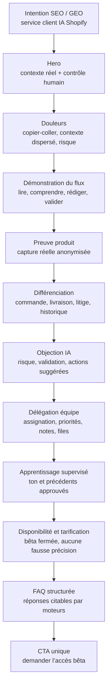

# Audit marché et tunnel de vente — Customer Service IA

Date de consolidation : 23 juillet 2026
Périmètre : landing page publique Scaliente, produit `customerPro`, marché des helpdesks et agents IA e-commerce.

## Décision exécutive

La page ne doit pas vendre « un chatbot de plus ». Le positionnement le plus défendable est :

> Une Inbox e-commerce assistée par IA, reliée au contexte Shopify, qui prépare la réponse et demande une validation humaine dès que le risque l’exige.

Ce positionnement répond aux objections les plus récurrentes observées sur le marché :

1. réponses plausibles mais factuellement fausses ;
2. automatisation opaque qui « part seule » ;
3. agents qui répondent sans voir la commande, la livraison ou le litige ;
4. passage à un humain tardif ou sans contexte ;
5. tarification difficile à anticiper entre sièges, tickets, conversations et résolutions ;
6. interfaces qui ajoutent des clics au lieu de réduire la charge de l’équipe.

La page mise donc d’abord sur le contexte et le contrôle, ensuite sur la vitesse. Elle ne promet ni taux de résolution, ni gain de temps, ni économie non mesurés.

## Hiérarchie des douleurs à adresser

| Priorité | Douleur acheteur | Preuve marché | Réponse produit visible |
|---|---|---|---|
| 1 | « L’IA peut inventer une réponse ou une action » | Discussions marchands sur les faux renseignements, le manque de confiance et les réponses à corriger | brouillon relu, niveau de risque, validation requise, actions seulement suggérées |
| 2 | « Le support ne voit pas toute l’histoire » | Besoin récurrent de retrouver commande, suivi, remboursements et échanges passés | contexte Shopify, livraison, litiges, historique client et conversations |
| 3 | « Les cas complexes sont mal escaladés » | Retours sur les handoffs tardifs et les excuses après erreur | files de validation, priorités, assignation, notes internes, responsable explicite |
| 4 | « La personnalisation de l’IA prend trop de temps » | Plaintes sur le travail de configuration et de maintenance | apprentissage supervisé depuis les réponses réellement envoyées, règles visibles |
| 5 | « Je ne sais pas combien cela coûtera » | Marché fragmenté entre prix par siège, ticket, conversation ou résolution | bloc disponibilité transparent ; prix public uniquement lorsque la facturation GA est réellement activée |
| 6 | « L’outil lui-même ralentit l’équipe » | Avis Shopify Inbox du 21 juillet 2026 sur les clics et le scan visuel | une vue conversation + contexte + brouillon + workflow, démontrée avec le produit réel |

Les conversations Reddit sont utilisées comme verbatims qualitatifs, pas comme mesure de fréquence ni comme statistique.

## Audit concurrentiel de la tarification

Tarifs observés le 23 juillet 2026. Ils peuvent évoluer ; la landing ne les cite pas directement.

| Offre | Modèle public observé | Implication pour Scaliente |
|---|---|---|
| Gorgias Helpdesk + AI Agent | Helpdesk Basic affiché à 50 USD/mois pour 300 tickets ; AI Agent facturé autour de 1 USD par interaction automatisée selon le palier, avec dépassement | expliquer précisément ce qui déclenche une unité facturée et éviter le cumul opaque |
| Intercom Essential + Fin | Essential à partir de 29 USD par siège/mois ; Fin à 0,99 USD par outcome, avec outcomes spécifiques plus chers | privilégier une unité simple et montrer le contrôle humain avant l’envoi |
| Tidio + Lyro | abonnement support, puis quota de conversations Lyro ; essai IA limité | rendre l’essai et le passage au payant lisibles |
| Siena | frais de plateforme affichés à 750 USD/mois plus environ 0,90 USD par ticket automatisé | positionner Scaliente pour le marchand Shopify qui veut une intégration métier compacte |
| Zendesk + Copilot / AI agents | prix par agent pour la suite, supplément Copilot, puis résolutions automatisées | éviter une architecture tarifaire à plusieurs couches pour la même promesse |
| Shopify Inbox | application gratuite, centrée chat et vente | différencier sur le support email, le contexte opérationnel, le risque et la collaboration |
| Yuma | tarification à la performance communiquée sur devis | fournir une règle de facturation publique vérifiable au moment de la GA |

Sources officielles :

- [Gorgias pricing](https://www.gorgias.com/pricing)
- [Gorgias AI Agent pricing, 28 mai 2026](https://www.gorgias.com/blog/ai-agent-pricing)
- [Intercom Fin outcomes](https://www.intercom.com/help/en/articles/8205718-fin-ai-agent-outcomes)
- [Intercom pour petites entreprises](https://www.intercom.com/small-business)
- [Tidio pricing](https://www.tidio.com/pricing/)
- [Siena pricing](https://www.siena.cx/pricing)
- [Zendesk pricing](https://www.zendesk.com/pricing/)
- [Zendesk automated resolutions](https://support.zendesk.com/hc/en-us/articles/5352026794010-About-automated-resolutions-for-AI-agents)
- [Shopify Inbox sur l’App Store](https://apps.shopify.com/inbox)
- [Yuma Support AI](https://yuma.ai/support-ai)

## Voix du marché

Les motifs retenus sont présents dans plusieurs conversations de marchands, mais ne constituent pas un sondage représentatif :

- [Gorgias ou Zendesk AI Agent, juillet 2026](https://www.reddit.com/r/ecommerce/comments/1uuet9s/has_anyone_tried_gorgias_or_zendesk_ai_agent/) : effort d’entraînement, erreurs à reprendre, difficulté sur les cas complexes et perception du coût.
- [Alternative à Gorgias, février 2026](https://www.reddit.com/r/shopify/comments/1r8p1gp/gorgias_alternative/) : inquiétude sur le coût total quand les résolutions IA et la voix s’ajoutent.
- [Résultats réels d’un chatbot IA Shopify](https://www.reddit.com/r/shopify/comments/1m68imr/anyone_seen_real_results_from_using_an_ai_chatbot/) : peur des réponses fausses, besoin de ton de marque, de contexte Shopify et d’un mode brouillon.
- [Outils de support Shopify](https://www.reddit.com/r/shopify/comments/1odw4jc/gorgias_vs_hellorep_vs_free_shopify_support_tools/) : priorité donnée au suivi de commande, aux retours et à la possibilité de tester.
- [Agent de support IA](https://www.reddit.com/r/shopifyDev/comments/1l386hf/ai_customer_support_agent/) : importance du contexte commande et de l’escalade en cas de faible confiance.

## Vérité produit

### Fonctionnalités présentes dans `customerPro`

| Capacité | Source produit | Formulation publique retenue |
|---|---|---|
| Classification des demandes | `src/config/inboxClassification.js` | commandes, remboursements, retours, annulations, facturation, litiges et demandes générales |
| Assignation et files | `src/config/inboxWorkflow.js`, composants Inbox | assignation, priorités, tags, notes internes et files de validation |
| Contexte commande | routes et services Inbox | commande, statut financier et logistique, articles et remboursements disponibles |
| Suivi livraison | construction du contexte Inbox | transporteur, numéro, URL et statut de suivi disponibles |
| Litiges Shopify Payments | construction du contexte Inbox | litiges ouverts reliés à la commande ou au client quand disponibles |
| Historique client | construction du contexte Inbox | commandes et conversations passées disponibles |
| Brouillon multilingue | génération de brouillon Inbox | réponse dans la langue du dernier message |
| Contrôle du risque | logique de brouillon et workflow | validation requise pour les situations à risque identifiées |
| Actions suggérées | génération et interface Inbox | l’IA suggère ; elle ne prétend pas avoir exécuté une action non confirmée |
| Apprentissage supervisé | règles de ton et précédents approuvés | apprentissage depuis les réponses envoyées, avec règles visibles et modifiables |

### État de commercialisation

L’Inbox reste protégée par le flag `INBOX_GA` et une allowlist. La page publique doit donc indiquer « bêta fermée » et demander un accès.

Le worktree `pricing-inbox-upsell` contient une proposition de facturation non encore publiée :

- 39 EUR par mois et par boutique activée ;
- 200 réponses IA incluses par boutique active, mutualisées au niveau du compte ;
- recharge de 100 réponses pour 10 EUR ;
- expiration des crédits après 90 jours ;
- abonnement Scaliente payant requis.

Source : `customerPro/.claude/worktrees/pricing-inbox-upsell/src/config/plans.js`, constantes `ADDONS.inbox`.

**Décision de publication :** ne pas afficher ces montants avant la mise en production de la facturation, du self-service et du flag GA. Les exposer maintenant créerait une promesse commerciale non tenable par le produit public.

## Tunnel de vente retenu

### Rôle de chaque étape

1. **Attirer** avec l’intention explicite « service client IA Shopify ».
2. **Rassurer** avant de parler d’automatisation.
3. **Montrer** le produit réel plutôt qu’une interface marketing fictive.
4. **Prouver** l’intégration métier avec les données disponibles.
5. **Traiter l’objection centrale** : l’IA ne doit ni inventer ni agir silencieusement.
6. **Élargir l’acheteur** du fondateur solo à l’équipe support.
7. **Expliquer l’amélioration continue** sans promettre une autonomie totale.
8. **Être transparent** sur la bêta et le pricing.
9. **Convertir** vers une demande d’accès, cohérente avec l’état du produit.

## Plan SEO et GEO

### Cluster principal

- service client IA Shopify
- logiciel support client Shopify
- boîte mail support Shopify
- IA réponse email client
- automatiser suivi commande Shopify
- agent IA e-commerce avec validation humaine

### Questions à couvrir textuellement

- Comment l’IA accède-t-elle aux commandes Shopify ?
- L’IA envoie-t-elle les réponses automatiquement ?
- Que se passe-t-il pour un remboursement ou un litige ?
- Peut-on assigner une conversation à un membre de l’équipe ?
- L’IA répond-elle dans la langue du client ?
- Comment l’IA apprend-elle le ton de la marque ?
- Combien coûte le service client IA Scaliente ?
- Le produit est-il déjà disponible ?

### Éléments techniques

- URL dédiée : `/[lang]/features/ai-customer-service`
- titre et description propres à chaque langue
- canonical et `hreflang` FR, EN, DE
- `BreadcrumbList` JSON-LD
- `FAQPage` JSON-LD construit depuis les réponses visibles
- captures descriptives avec textes alternatifs localisés
- contenu rendu côté serveur pour l’indexation
- aucun chiffre de performance, aucune comparaison concurrentielle non démontrée

## Copy publiée

Angle central :

> Chaque réponse commence par le contexte. Pas par une supposition.

Promesse fonctionnelle :

> Scaliente rassemble l’email, la commande, la livraison, les litiges et l’historique client pour préparer une réponse que votre équipe peut vérifier, assigner et envoyer.

Preuves visibles :

- deux captures réelles anonymisées ;
- détail du contexte Shopify disponible ;
- workflow à quatre étapes ;
- garde-fous et validation requise ;
- collaboration d’équipe ;
- disponibilité bêta et absence assumée de prix public.

## Mesure recommandée après publication

Les événements déjà ajoutés à la page permettent de suivre :

- clic d’accès bêta dans le hero ;
- clic d’accès bêta dans le bloc disponibilité ;
- clic d’accès bêta final.

À ajouter lors de la GA :

- passage du bloc pricing au formulaire ;
- choix d’un nombre de boutiques ;
- compréhension du quota, testée par une micro-question ou le taux d’ouverture de FAQ ;
- activation de l’Inbox ;
- premier brouillon généré ;
- premier brouillon approuvé, modifié ou rejeté ;
- taux d’escalade vers validation par catégorie, sans transformer ce taux en promesse publique avant mesure stable.
